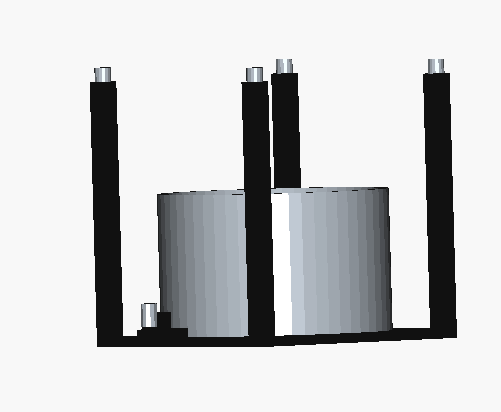
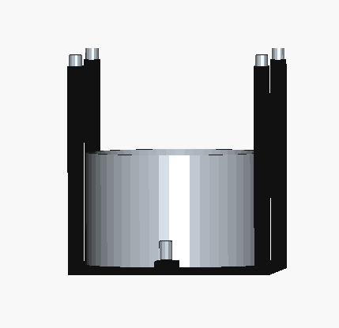
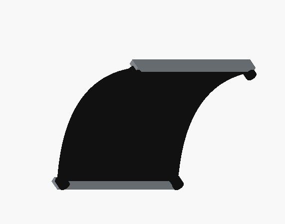
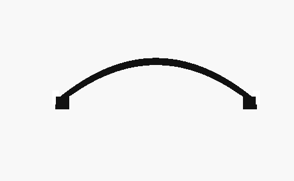
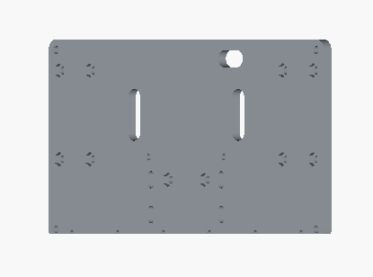
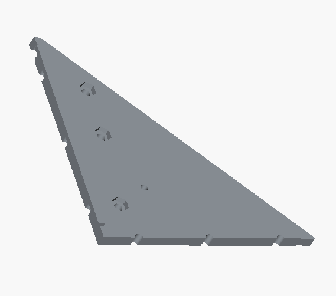
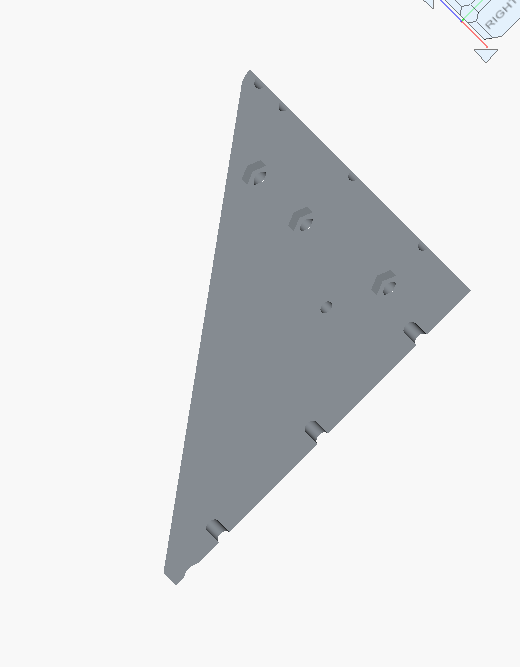

# The Odyssey
Lillian Slaton | lslaton@cub.uca.edu

## Wonklet

Autonomous navigation project for the HomeR robot. The robot navigates from Room 159 to Room 171 in the Lewis Science Center, delivering a cup of coffee to the front desk.

---

## Coffee Transportation Solution

### Mechanical Design

The coffee cup holder consists of a trailer with a deep set cavity designed to hold a standard 12 oz cup securely during robot navigation. It also has four vertical beams on all corners to secure a small roof. These designs were 3D printed, and castor wheels were screwed into the back two corners.

**Front View:**


**Side View:**


**Roof:**




**Trailer Body** (holds the cup):
- Width: 108mm
- Depth: 127.5mm  
- Height: 118mm

**Trailer Roof** (secures the cup from the top):
- Width: 116mm
- Depth: 112.3mm
- Height: 28.5mm

Key design decisions:
- Low center of gravity mount to reduce spilling during turns
- Friction-fit ring to secure cup without mechanical fasteners
- Vertical support beams in case of cup tipping, will catch cup before fall.

### Robot Base Design
Since I was working on my own robot this time, I had to create a base for my robot. Due to size constraints of my at home 3D printer, the base of my robot needed to be printed in 3 different sections. 
**Base Piece 1:**


**Base Piece 2:**


**Base Piece 3:**



### Hardware Installation Guide
1. Print the cup holder
2. Drill holes into back corners and screw in castor wheels
3. Attach "hook" of the trailer to drilled hole in the back of Wonklet Bot

---

## Software Usage Instructions

### Installing Dependencies on Raspberry Pi
```bash
sudo apt update && sudo apt upgrade -y
sudo apt install software-properties-common curl -y
sudo curl -sSL https://raw.githubusercontent.com/ros/rosdistro/master/ros.key -o /usr/share/keyrings/ros-archive-keyring.gpg
echo "deb [arch=$(dpkg --print-architecture) signed-by=/usr/share/keyrings/ros-archive-keyring.gpg] http://packages.ros.org/ros2/ubuntu $(. /etc/os-release && echo $UBUNTU_CODENAME) main" | sudo tee /etc/apt/sources.list.d/ros2.list > /dev/null
sudo apt update
sudo apt install ros-jazzy-ros-base -y
echo "source /opt/ros/jazzy/setup.bash" >> ~/.bashrc
sudo apt install python3-rosdep python3-colcon-common-extensions git -y
sudo rosdep init && rosdep update
mkdir -p ~/homer_ws/src && cd ~/homer_ws/src
git clone https://github.com/linzhanguca/homer_bringup.git
cd ~/homer_ws
rosdep install -y --from-paths src --ignore-src --rosdistro $ROS_DISTRO
colcon build
echo "source ~/homer_ws/install/local_setup.bash" >> ~/.bashrc
source ~/.bashrc
```

### Installing Dependencies on Server Computer
```bash
sudo apt update && sudo apt upgrade -y
# Install ROS 2 Jazzy (same steps as RPi above)
sudo apt install ros-jazzy-slam-toolbox -y
sudo apt install ros-jazzy-navigation2 ros-jazzy-nav2-bringup -y
mkdir -p ~/homer_ws/src && cd ~/homer_ws/src
git clone https://github.com/linzhanguca/homer_navigation.git
cd ~/homer_ws
colcon build
echo "source ~/homer_ws/install/local_setup.bash" >> ~/.bashrc
source ~/.bashrc
```

### Network Configuration
```bash
echo "export ROS_DOMAIN_ID=85" >> ~/.bashrc
sudo apt install ros-jazzy-rmw-cyclonedds-cpp -y
echo "export RMW_IMPLEMENTATION=rmw_cyclonedds_cpp" >> ~/.bashrc
source ~/.bashrc
```

### Starting Map Creation
```bash
# On Raspberry Pi:
ros2 launch homer_bringup homer_launch.py

# On Server Terminal 1:
ros2 launch homer_navigation create_map.launch.py

# On Server Terminal 2:
ros2 run teleop_twist_keyboard teleop_twist_keyboard
```

### Saving the Map
1. In RViz, go to SlamToolboxPlugin panel
2. Type absolute path next to Serialize Map (e.g. `/home/username/maps/P03`)
3. Click Serialize Map
4. Verify `P03.data` and `P03.posegraph` are created

**CLI method:**
```bash
ros2 service call /slam_toolbox/serialize_map slam_toolbox/srv/SerializePoseGraph "{filename: '/home/username/maps/P03'}"
```

### Starting Autonomous Navigation
```bash
# Edit map path:
nano ~/homer_ws/src/homer_navigation/configs/localization_params.yaml
# Set: map_file_name: /home/username/maps/P03

# Rebuild:
cd ~/homer_ws && colcon build && source ~/.bashrc

# On Raspberry Pi:
ros2 launch homer_bringup homer_launch.py

# On Server:
ros2 launch homer_navigation navigation.launch.py

# Run navigation node on Raspberry Pi:
ros2 run wonklet navigate
```

---

## Navigation Node

The `wonklet` package contains the autonomous navigation node. It uses the **ROS 2 action client** to send a `NavigateToPose` goal to Nav2, which handles path planning and obstacle avoidance autonomously.

### Navigation Approach
1. The robot localizes itself on the saved map using slam_toolbox in localization mode
2. The `wonklet` node sends a `NavigateToPose` action goal to Nav2 with the coordinates of Room 171 front desk
3. Nav2 uses the NavFn global planner to compute a path and the Regulated Pure Pursuit controller to follow it
4. The robot receives continuous feedback on distance remaining until goal is reached
5. Upon arrival, the node logs "Coffee delivered!" and shuts down

### Nav2 Configuration
Configuration is located in `wonklet/config/nav2_params.yaml`. Key settings:
- **Robot radius:** 0.15m
- **Inflation radius:** 0.35m (keeps robot away from walls)
- **Max linear velocity:** 0.15 m/s (slow for coffee delivery AND making sure wonklet doesn't flip foward)
- **Goal tolerance:** 0.25m XY, 0.25 rad yaw

### Map Files
Located in `/maps` directory:
- `P03.data`
- `P03.posegraph`

Map recorded in the Lewis Science Center hallway between Room 159 and Room 171.

### Running the Navigation Node
```bash
# On Raspberry Pi:
ros2 launch homer_bringup homer_launch.py

# On Server:
ros2 launch homer_navigation navigation.launch.py

# On Raspberry Pi (new terminal):
ros2 run wonklet navigate
```

The robot will autonomously navigate to Room 171 front desk and indicate completion in the terminal.
---

## License
MIT
